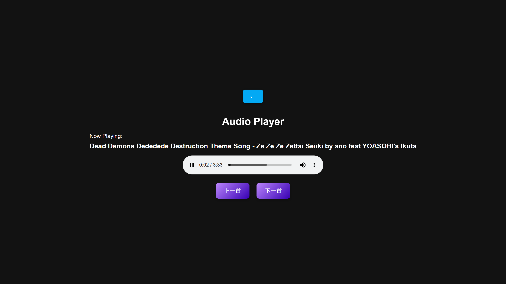

# Web-Music-Player
 A tiny web music player, including youtube audio downloading and data management. 



## Features
- **Lightweight web music player**: A small and efficient web-based music player that allows you to play your favorite tracks directly from your browser.
- **Can be deployed locally or publicly**: Flexibility to run the music player on your local machine for personal use or deploy it on a public server for wider access.
- **Download audio from a given YouTube playlist link/ID**: Easily download audio tracks from YouTube by providing a playlist link or ID, enabling offline listening.
- **Manage downloaded audio files**: Organize and manage your downloaded audio files with ease, ensuring your music library is always up-to-date and well-maintained.

## Getting started

### Installation

Environment: Python 3.10 or above

Clone the repository.
```shell
$ git clone git@github.com:D101028/Web-Music-Player.git
$ cd Web-Music-Player
```

Build the virtual environment. 
```shell
$ python3 -m venv .venv
```

Activate the virtual environment.

On Windows:
```shell
$ .venv\Scripts\activate
```

On Unix or MacOS:
```shell
$ source .venv/bin/activate
```

Install the required modules.
```shell
$ pip install -r requirements.txt
```

### Usage
To modify the `config.conf` file, follow these steps:

1. Open the `config.conf` file in a text editor of your choice.
2. Make the necessary changes to the configuration settings.
3. Save the file.

Ensure that the paths and settings match your requirements.

To start the web music player service, run the following command:

```shell
$ python main.py
```
or
```shell
$ python main.py -c /path/to/your/config.conf
```

This will launch the web server, and you can access the music player through your web browser at `http://localhost:5000` as default.